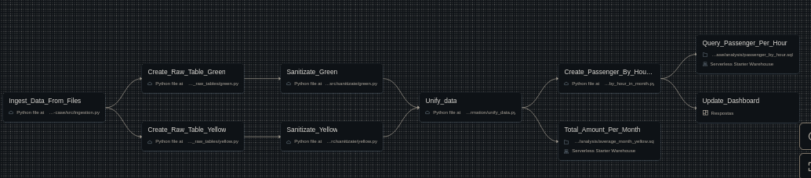

# ifood-case
A data engineering pipeline for insights for NYC Taxi Trips Data.

This case is defined to be executed in [Databricks Platform](https://www.databricd-case)
A data engineering pipeline for insights for NYC Taxi Trips Data.

## Pipeline Overview

## Requeriments
- AWS Credential with access to S3
- An Instance of Databricks
- Setting up your S3 credentials in Databricks Secrets (for data fetching and save)

## Setting Up
- Create a Databricks Free Edition Instance
- Download Databricks CLI with `pip install databricks-sdk`
- Authenticate with `databricks auth login --host {YOUR_INSTANCE_URL}`
- Create a secret scope with `databricks secrets create-scope aws`
- Save your secrets with:
    - `databricks secrets put-secret aws {AWS_ACCESS_KEY_ID}`
    - `databricks secrets put-secret aws {AWS_SECRET_ACCESS_KEY}`
- Clone the repo inside your workspace in Databricks UI. Workspace > Create > Git Folder
- Execute the pipeline
- Check the Dashboards for the answers 

## Caveats Regards S3 Integration
Is possible to use the `External Location` on Databricks to fetch data from S3 as a table automatically but in this present case the disparity in the files schemas causes a lot of silent problems, with many records missing in the datalake. This problem was fixed using the `create_raw_table` step.

